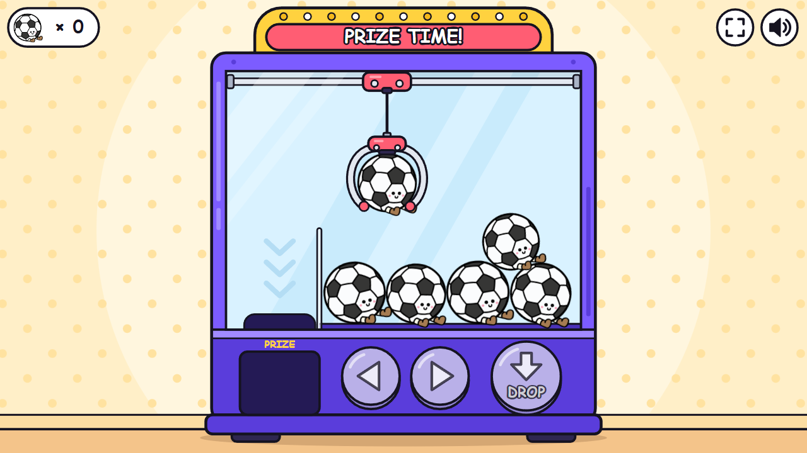
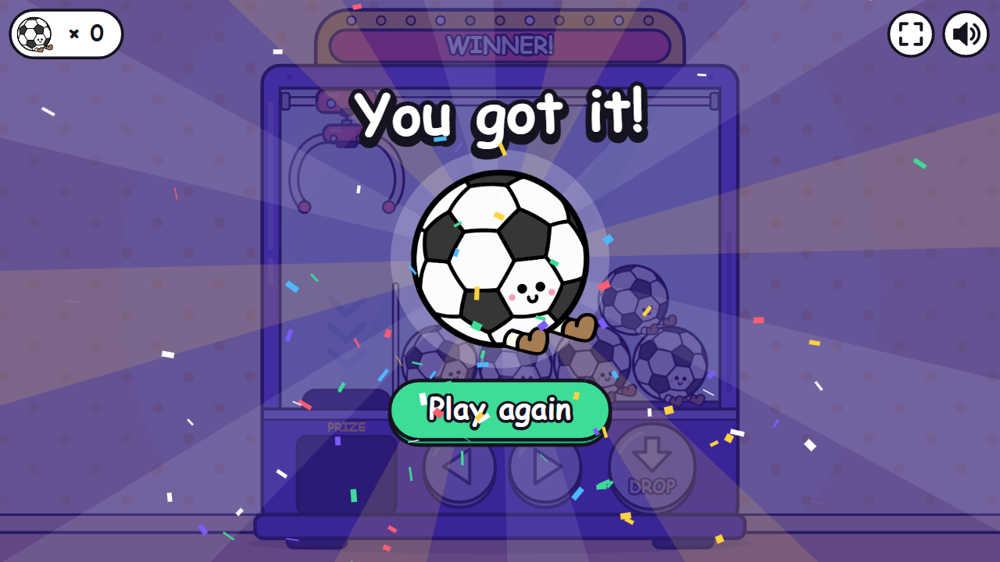

# Claw Machine

A small claw machine reward game for the classroom.
It runs in the browser from one HTML file.
There is nothing to install and no login.

**Play it here: https://claw-machine-demo.vercel.app**

<p>
  
  
</p>

## How to run

Open the link above, or run it from your own computer:

1. Download this repository.
2. Double-click `index.html`.

It opens in Chrome, Edge or Safari.
It needs no server, no build step and no internet.

## How to play

| Action | Mouse or touch | Keyboard |
| --- | --- | --- |
| Move the claw | The two arrow buttons, or tap or drag inside the glass | Left and Right arrow, or A and D |
| Drop the claw | The DROP button | Space, Enter or Down arrow |
| Play again | The Play again button | Space or Enter |
| Sound on or off | The speaker button | M |
| Full screen | The full screen button | F |

Hold an arrow button to keep the claw moving.
A quick tap moves it one small step.

The claw grabs the toy right below it.
When the claw is in the right place, that toy wiggles and the DROP button pulses.
If nothing is below the claw, it comes up empty and the player can try again.

## Features

- The claw moves, drops, closes, lifts and carries the toy to the chute.
- The motion is smooth, with a swinging cable and soft starts and stops.
- Six toys sit in a pile with simple physics, and the machine refills when it is empty.
- A win screen shows the prize with confetti, and a counter keeps the number of prizes.
- Mouse, touch and keyboard all work, also at the same time.
- The picture scales to any screen, from a phone to a 4K interactive whiteboard.
- The sounds are made in code, so there are no audio files, and the mute choice is remembered.
- It is light for old devices: fixed parts are drawn only once, and the game lowers its own resolution on a slow device.

## How it is built

- Everything is in `index.html`: the page, the styles, the script and the toy picture.
- The script is plain JavaScript on a Canvas, with no libraries.
- It uses only old (ES5) JavaScript syntax, so old tablets can run it.
- The machine, the claw, the buttons and the confetti are drawn in code.
- The only image is the toy, stored as base64 text at the bottom of the file.
- The page makes no outside requests.

## Change the game

### Settings

The `SETTINGS` block at the top of the script holds the numbers and texts that are most useful to change.

| Setting | What it does |
| --- | --- |
| `moveSpeed`, `moveAccel`, `moveBrake` | How fast the claw moves, starts and stops |
| `dropSpeed`, `liftSpeed`, `carrySpeed` | How fast the claw goes down, comes up and carries a toy |
| `grabRange` | How close the claw must be to the middle of a toy (1 is easy, lower is harder) |
| `autoAlign` | Slides the claw over the middle of the toy while it drops |
| `sound` | Sound on or off at the start |
| `title`, `startMessage`, `missMessage`, `winSign`, `winMessages`, `againLabel` | The texts on the sign, on the win screen and on the button |

### Toys in the machine

`FLOOR_ROW` and `TOP_ROW` list the toys.
Each toy has a size (`r`) and a resting tilt (`tilt`).
Each top toy rests in a gap of the floor row (`gap`).
Keep the floor row full, which means its `r` values add up to about 258.

### Use another toy picture

The game treats every toy as a circle, so round toys fit best.

1. Make a PNG with a transparent background, about 640 pixels wide.
2. Turn it into base64 text (see the commands below).
3. Paste that text into the `toy-art` block at the bottom of `index.html`, in place of the old text.
4. Set `TOY_ART` to the middle and the size of the round body of the toy.
   `cx` and `r` are fractions of the picture width, and `cy` is a fraction of its height.

Windows (PowerShell), copies the text to the clipboard:

```powershell
[Convert]::ToBase64String([IO.File]::ReadAllBytes((Resolve-Path toy.png))) | Set-Clipboard
```

Mac, copies the text to the clipboard:

```bash
base64 -i toy.png | pbcopy
```

## Tested

- Chrome and Edge on Windows, with scripted browser runs.
- Full rounds with mouse, touch and keyboard, the miss case, winning all six toys, the refill, and resizing in the middle of a round.
- Eleven screen sizes, from 320 x 480 to 3840 x 2160.
- The hosted link, with one full round in Chrome.
- No console errors and no outside requests.

Still to check by hand: Safari on an iPad or a Mac, and a real Chromebook.

## Files

| File | What it is |
| --- | --- |
| `index.html` | The whole game |
| `README.txt` | A short plain note for people who get the game as a zip |
| `screenshots/` | The pictures on this page |

To share the game as a zip, pack `index.html` and `README.txt`:

```powershell
Compress-Archive -Path index.html, README.txt -DestinationPath claw-machine-demo.zip -Force
```

## Rights

This is a trial project made for a client.
The soccer ball illustration belongs to the client and is used here only for this demo.
There is no open source licence.
Please do not copy or reuse the code or the artwork without permission.
